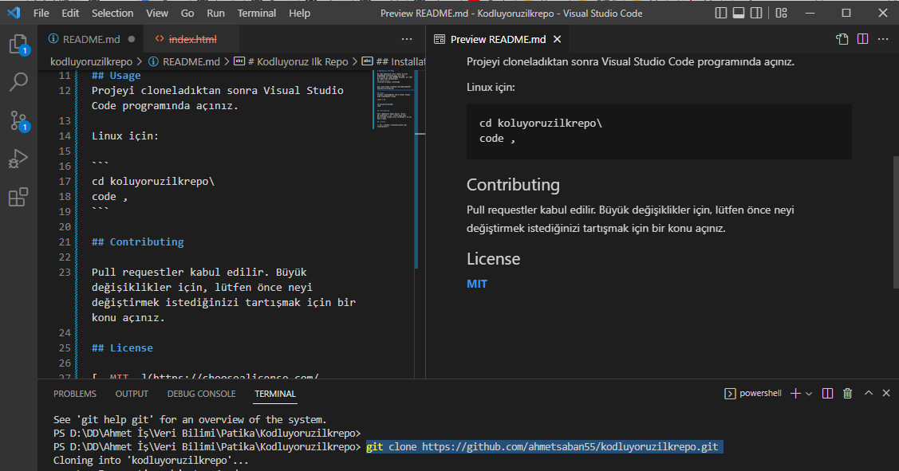

# Kodluyoruz Ilk Repo

Bu repo Kodluyoruz ve [Patika](https://patika.dev) Veri (Data) Eğitimi kapsamında oluşturduğumuz ilk repo. İçerisinde bir adet README dosyası, bir adet de index.html barındırıyor.
## Installation
Öncelikle projeyi clonelayın.

```
git clone https://github.com/ahmetsaban55/kodluyoruzilkrepo.git
```

## Usage
Projeyi cloneladıktan sonra Visual Studio Code programında açınız.

Linux için:

```
cd koluyoruzilkrepo\
code ,
```

## Contributing

Pull requestler kabul edilir. Büyük değişiklikler için, lütfen önce neyi değiştirmek istediğinizi tartışmak için bir konu açınız.

## License

[__MIT__](https://choosealicense.com/licenses/mit/)




